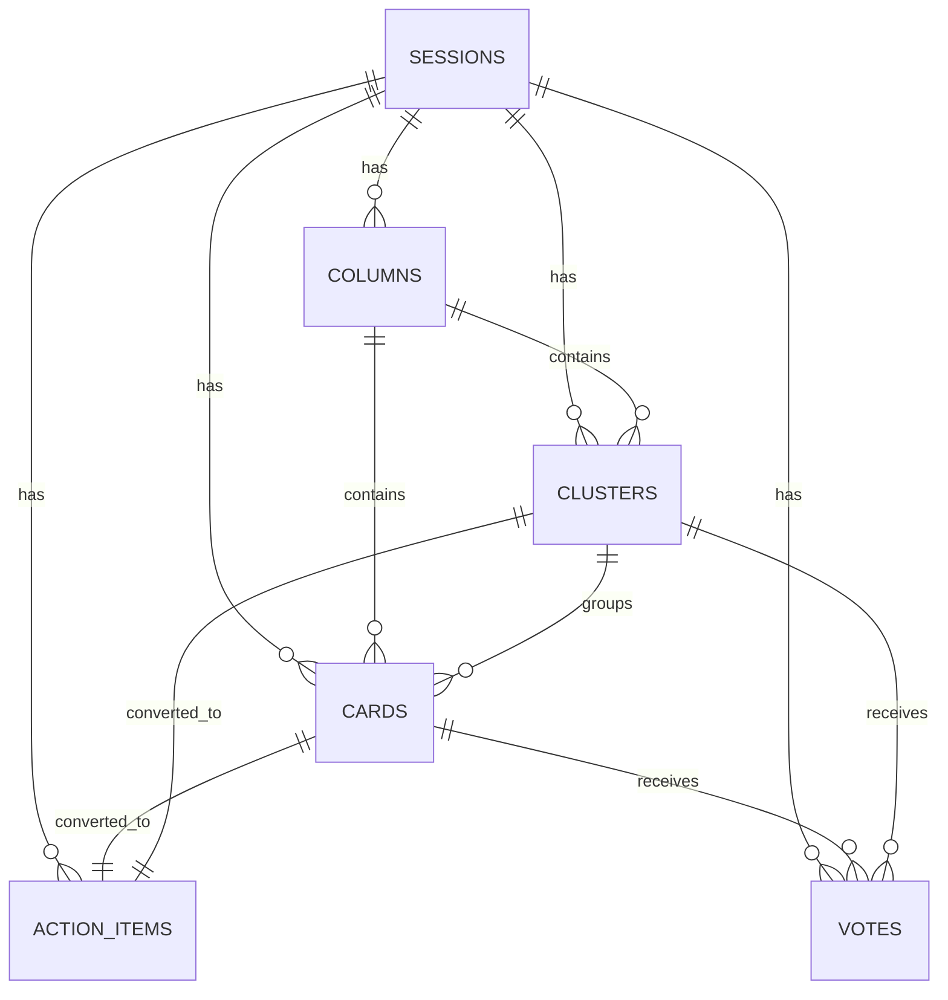

# DBA Mission Report

**Agent**: dba  
**Generated**: 2026-08-10T21:10:10.185Z

---

## Database Engine: PostgreSQL 15

PostgreSQL provides strong ACID guarantees, rich relational features, JSON support for complex queries, and is already selected in the tech stack (Supabase managed PostgreSQL). It scales with read replicas and supports the transactional consistency needed for real‑time board operations.

## Entities (6)

- **sessions**: 7 columns
- **columns**: 6 columns
- **clusters**: 7 columns
- **cards**: 9 columns
- **votes**: 7 columns
- **action_items**: 11 columns

## ERD

