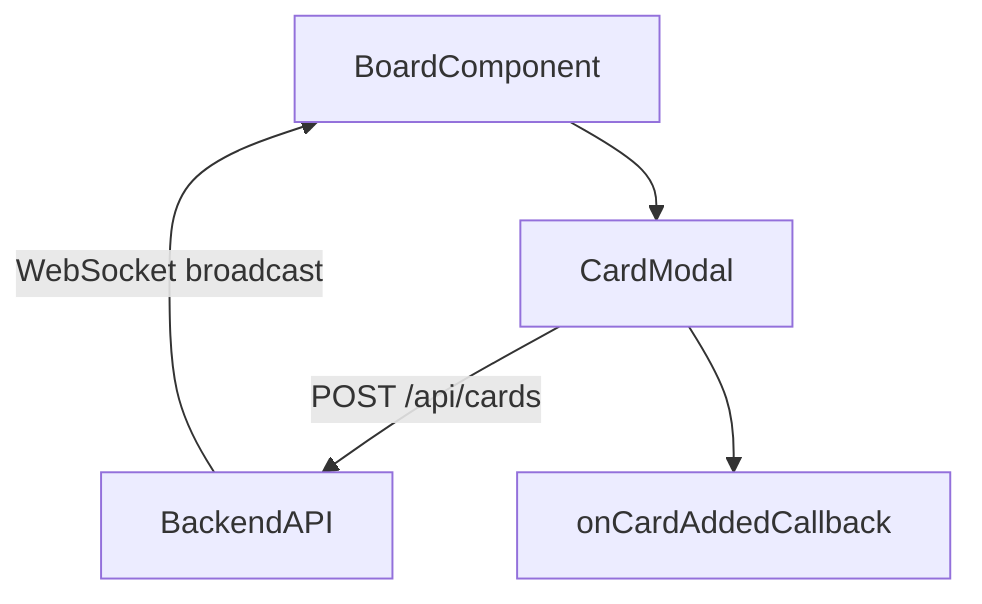

# Junior React Developer Mission Report

**Agent**: junior-react  
**Generated**: 2026-08-10T21:37:40.972Z

---

## Branch: retroboard3/feature/us-003-board-view

## Files Changed

- **created** `packages/frontend/src/components/CardModal.tsx` — Implemented CardModal component with controlled inputs for content and author name, handling submit to POST /api/cards and invoking onCardAdded callback on success.
- **created** `packages/frontend/src/components/CardModal.test.tsx` — Added unit test for CardModal using React Testing Library, mocking fetch and verifying onCardAdded callback is called on successful submission.

## Notes

Component assumes existence of a POST /api/cards endpoint that accepts JSON { content, authorName, columnId } and returns the created card. The CardModal receives props: isOpen (boolean), onClose (function), columnId (string), and onCardAdded (function) to refresh board state. Test uses jest.spyOn(global, 'fetch') to mock API response. No further wiring needed for this story; board component will import and use CardModal.

## Diagram

