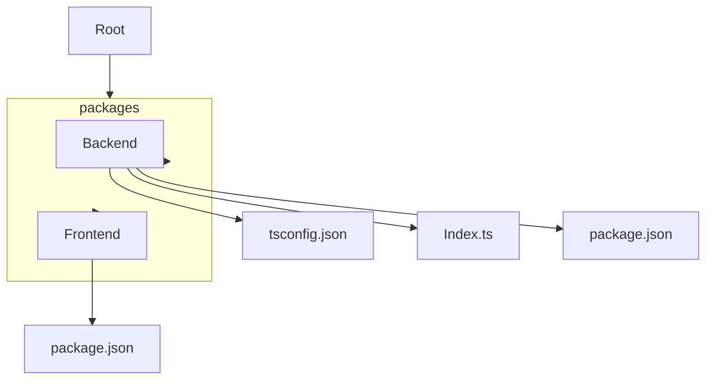

# Principal Backend Developer Mission Report

**Agent**: principal-backend  
**Generated**: 2026-08-10T21:12:04.225Z

---

## Branch: retroboard3/chore/scaffold

## Files Changed

- **created** `package.json` — Initialized root package.json with npm workspaces and root scripts
- **created** `packages/backend/package.json` — Created backend package manifest for TypeScript Express project
- **created** `packages/backend/tsconfig.json` — Added TypeScript configuration for backend source compilation
- **modified** `packages/backend/package.json` — Added dev dependencies (jest, supertest, ts-jest) and scripts (dev, build, start, test) for backend
- **created** `packages/frontend/package.json` — Created frontend package manifest with Vite, React, and TypeScript dependencies
- **created** `packages/backend/src/index.ts` — Implemented basic Express server with health endpoint and export for testing

## Notes

Scaffolded monorepo with npm workspaces, set up backend TypeScript project, added basic Express server, and prepared package manifests for both frontend and backend.

## Diagram

